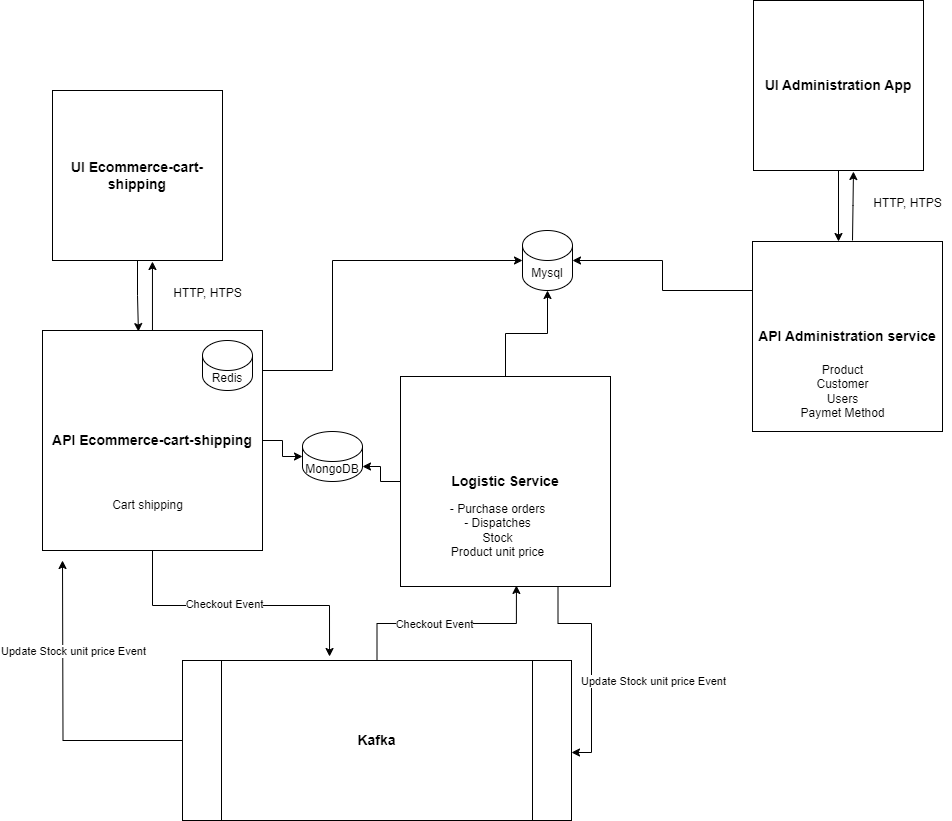
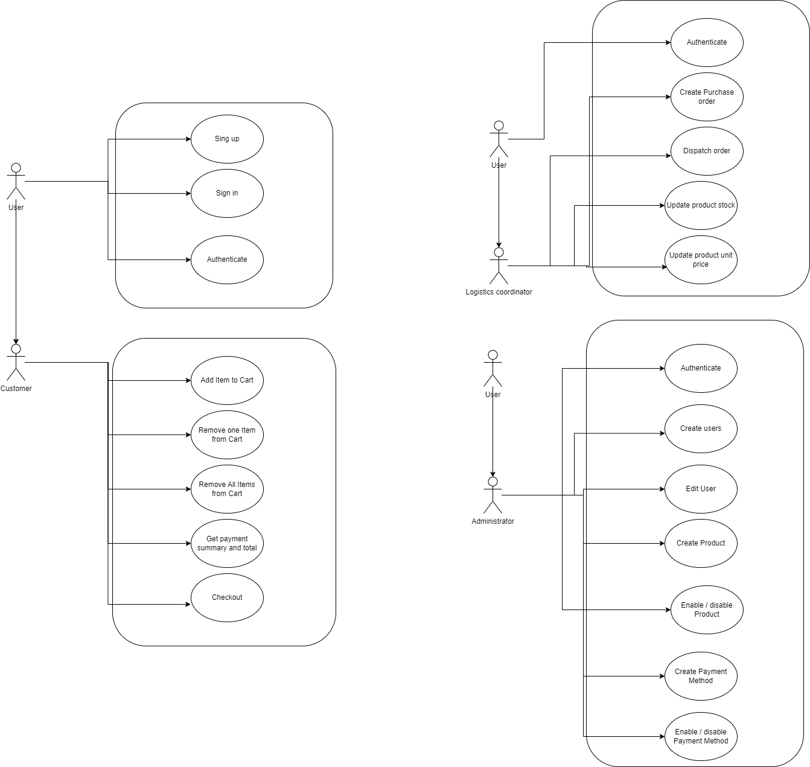

# Shopping Cart 🛒

Shopping Cart is a sample code used to validate coding best practices using the Java language.

## Pre requirements
- Java 17 or greater and create the home Java environment variable
- Gradle [7.6.4](https://gradle.org/releases) or greater and create the Gradle home and Gradle Bin paths in environment variables
- Redis Server or use an [docker image](https://hub.docker.com/_/redis)

This project has the following configuration for redis
```bash
docker pull redis
docker run --name redis-server -d -p 6379:6379 redis --requirepass password
```

## Installation

This repository doesn't include the Gradle wrapper so if you prefer to run this project using the wrapper 
you have downloaded and configured gradle and created the wrapper for the first time.

```bash
./gradle wrapper
```

## Build

To build execute the following command
```bash
./gradlew clean build
```

## Run

To build execute the following command
```bash
./gradlew bootRun
```
Then you can access to [swagger api specification](http://localhost:8080/swagger-ui/index.html):

The system has preconfigured the following products (id, description)

| Id | Product |
|--|--|
| 379fbb01-ff84-4a61-8856-afa2d52b3974 | Banana     |
| 560a00dd-6864-49b9-b3f5-1ef420a0efca | Orange     |
| 2f04919e-b6a8-4235-ac96-69c1659fa965 | Strawberry |

The following is a list of the allowed operations in the API specification:

| Method | URI                              | Description                                              |
|--------|----------------------------------|----------------------------------------------------------|
| POST   | /api/v1/product/{productId}/item | Add Item to Cart                                         |
| Delete | /api/v1/product/{productId}/item | Delete an Item from Cart                                 |
| Get    | /api/v1/product/{productId}/item | Get the Items from the Cart                              |
| Delete | /api/v1/items                    | Delete all the Items from the Cart                       |
| POST   | /api/v1/checkout                 | Checkout the items in the cart                           |  
| POST   | /api/v1/customer                 | Create a new customer                                    |
| Get    | /api/v1/customer                 | Get the customers information filter by query parameters |

## Run the tests

To build execute the following command
```bash
./gradlew bootTestRun
```

## Project folder description

- src/main/resources/design: The design of system.
- .github/workflow: Github Action workflow.
- src/main/resources/application.yml: the spring application configuration.
- src/main/resources/api:  Open API Specification definition.
- src/main/resources/config/liquibase:  Liquibase database change management.
- src/main/java/com/perficient/shoppingcart/application: the application layer.
- src/main/java/com/perficient/shoppingcart/domain: the domain layer.
- src/main/java/com/perficient/shoppingcart/infrastructure: the infrastructure layer.
- src/test/java/com/perficient/shoppingcart: unit test and component tests.
- src/test/resources/application.yml: the spring test configuration.
- src/test/java/challenge: it contains the initial class of the challenge (See the next session for more information).

## Design


### Scope
The scope of this application is to allow shopping cart transactions, the operations that can be performed with the shopping cart are.

- Add item
- Remove an item
- Get the total amount with discount and details with a payment method.
- Remove all items
- Control, manage the availability of items in stock.
- Store checkout information and generate an event to the dispatch department.

### Global Architecture (Microservices) 



### E-commerce shipping cart architecture


### Actor User Case


## Technologies

This project implemented the use of the following technologies

- Open API Specification (OAS) to API specification generate code,and document and Swagger interface
- Liquibase (database change management)
- H2 Database (in memory)
- Redis
- Lombok
- spring-boot-starter-web
- spring-boot-starter-data-jpa
- Gradle
- Github action workflow (to run CI in Github)


## Challenge

The exercise is used to:

* Validate the correct usage of keywords like `final`, `synchronized`, among others as well as object-oriented programming best practices by applying OOP, SOLID, GRASP and design principles and patterns.

* Validate coding best practices by promoting a refactor of the code taking advantage that the exercise has some code smells, on purpose, in order to challenge the candidate to find them and refactor the code with the objective to improve it.

* Understand the unit testing practices of the candidate by making use of unit tests that should be completed based on unit testing best practices.

* Understand that the candidate knows how to build java applications using modern application frameworks like Spring, Micronaut, Quarkus, Helidon, among others by applying coding best practices, design principles, and patterns.

## Homework

Create the application shopping-cart using the application framework of your preference. It could be Spring Boot, Quarkus, Micronaut, Helidon, or similar. Through a Rest API, the system should be able to manage shopping carts. That means that we can add and remove items to and from shopping carts as well as getting the state of them. This is an example of the shopping cart rendered through a UI (UI is out of scope).

|Quantity  | Product |Unit Price |Subtotal|
|--|--|--|--|
| 2 | Banana     | 2,000.00 | 4,000.00  |
| 3 | Orange     | 1,000.00 | 3,000.00  |
| 3 | Strawberry | 2,000.00 |  6,000.00 |

Total shopping cart: 13,000.00

Total payment: 14,060.00

The logic for the total and the total payment is given by the class com.perficient.shoppingcart.challenge.ShoppingCart.
The application should:

1. Expose the operations through a Rest API that follows the Rest API best practices.
1. Have persistence including database scripts and configurations required for it.
1. Contain unit tests as well as integration tests that follow the testing best practices.
1. Have a README file that explains how to start the application and consume the services. If the API has a live specification like Swagger, it must specify the endpoint.
1. Allow to get the total payment based on the payment method specified through the API. Remember that different payment methods derive in different values.
1. Allow to add new payment methods by following design best practices and patterns.
1. Implement security for the API and OWASP best practices.
1. In general, have design and architecture best practices.
1. Make assumptions and explain them in the README.
1. Send the code compressed in a zip file to <evaluator’s email>. Source code only.

## Contributing

Pull requests are welcome. For major changes, please open an issue first to discuss what you would like to change.

Please make sure to update tests as appropriate.
